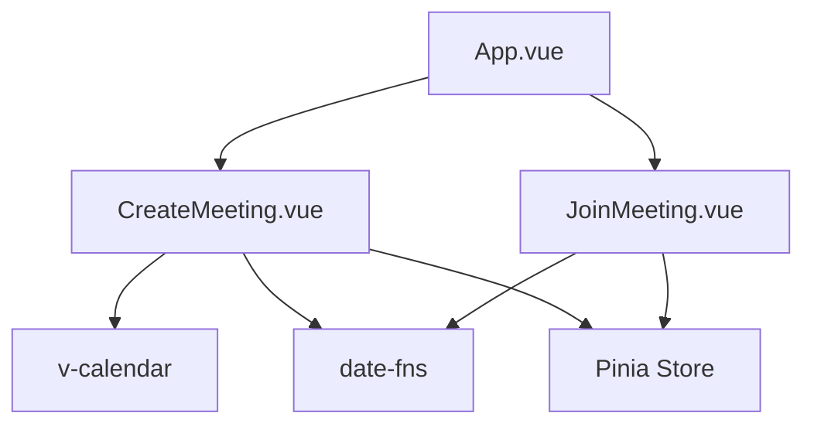
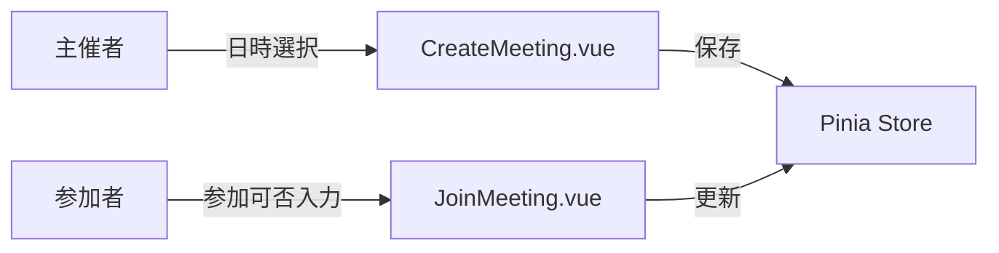

# 会議調整アプリ 引き継ぎドキュメント

## プロジェクト概要
会議の日程調整を効率化するWebアプリケーション。主催者が候補日時を提示し、参加者が都合を入力できる。

### 主要機能
1. **主催者機能** (CreateMeeting.vue)
   - カレンダーからの日付選択（1日ずつクリック）
   - 時間帯の一括設定
   - ドラッグ操作による時間帯の一括削除

2. **参加者機能** (JoinMeeting.vue)
   - 候補日時への参加可否入力（○→△→×）
   - コメント入力
   - ドラッグ操作による一括入力

## 技術スタック
```yaml
frontend:
  framework: Vue 3
  build_tool: Vite
  state_management: Pinia
  ui_components:
    - v-calendar: カレンダー表示
    - date-fns: 日付操作
  testing:
    - selenium: E2Eテスト
    - pytest: テストフレームワーク
```

## 環境構築
```bash
# フロントエンド開発環境セットアップ
cd frontend
npm install

# 開発サーバー起動（ポート3002固定）
PORT=3002 npm run dev

# Seleniumテスト環境セットアップ
cd frontend
python3 -m venv venv
source venv/bin/activate
pip3 install -r requirements.txt
```

## ファイル構造と依存関係
```
frontend/
├─ src/
│  ├─ components/
│  │  ├─ CreateMeeting.vue  # 主催者画面
│  │  └─ JoinMeeting.vue    # 参加者画面
│  ├─ App.vue               # ルートコンポーネント
│  └─ main.js              # アプリケーションエントリーポイント
├─ tests/
│  └─ drag_delete_test.py   # ドラッグ操作のSeleniumテスト
└─ vite.config.js          # Vite設定
```

## コンポーネント依存関係


## データフロー


## 既知の課題と対応方法
1. **ドラッグ操作の制御**
   - 問題: ドラッグ開始点の状態が正しく反映されない
   - 解決: mousedownイベントでの初期状態保存を確実に行う

2. **パフォーマンス最適化**
   - 課題: 大量の時間帯表示時の描画遅延
   - 対策: 仮想スクロールの導入を検討

## テスト戦略
1. **E2Eテスト (Selenium)**
   ```python
   # tests/drag_delete_test.py
   def test_drag_delete():
       # ドラッグによる時間帯削除のテスト
   ```

2. **手動テスト項目**
   - [ ] 日付選択の正常動作
   - [ ] 時間帯の一括設定
   - [ ] ドラッグ操作の挙動
   - [ ] レスポンシブデザインの確認

## セキュリティ考慮事項
1. XSS対策
   - Vue.jsのテンプレートエスケープを活用
   - ユーザー入力の適切なサニタイズ

2. CSRF対策
   - トークンベースの認証を実装予定

## 次期開発タスク候補
1. バックエンド連携
   - APIエンドポイントの設計
   - データ永続化の実装

2. UI/UX改善
   - モバイル対応の強化
   - アクセシビリティ対応

3. 機能拡張
   - 繰り返し予定の設定
   - 参加者の出欠統計表示

## 開発環境要件
- Node.js 18.x以上
- Python 3.8以上
- Chrome/Chromium（Seleniumテスト用）

## 参考リンク
- [Vue.js公式ドキュメント](https://vuejs.org/)
- [v-calendar公式ドキュメント](https://vcalendar.io/)
- [Selenium with Python](https://selenium-python.readthedocs.io/)
