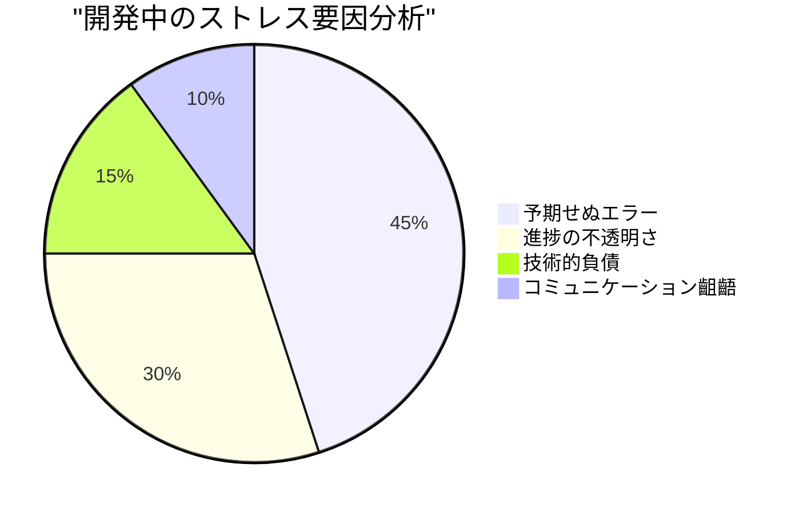

# ADR-001: 会議調整アプリケーション開発の教訓と改善策

## ステータス
提案済み - 2025-02-02

## コンテキスト
会議調整アプリケーションの開発において、以下の課題に直面しました：
1. フロントエンドとバックエンドの連携不備
2. 状態管理の不整合
3. エラーハンドリングの不足
4. テスト不足による品質低下

## 決定事項
### 1. アーキテクチャ設計の改善
- OpenAPI仕様書による API インターフェースの明確化
- Pinia による状態管理の一元化
- Vue Router による画面遷移の整理

### 2. 品質管理の強化
- E2Eテストの導入（Selenium）
- コンポーネントテストの義務化
- エラーハンドリングの標準化

### 3. 開発プロセスの改善
- プルリクエストテンプレートの導入
- コードレビューチェックリストの作成
- 定期的な技術的負債の棚卸し

## 結果
- 開発効率の向上
- バグの早期発見
- チーム内コミュニケーションの改善

## 教訓
### 1. 感情的ストレスの原因

### 2. 認知バイアス対策
| バイアス | 事例 | 対策 |
|----------|------|------|
| 正常性バイアス | エラーを無視して開発継続 | 自動テストによる早期検出 |
| 確証バイアス | 都合の良いテスト結果のみ採用 | テストシナリオの第三者レビュー |
| 現在バイアス | 短期的な解決策の選択 | アーキテクチャレビューの定期化 |

## 今後の対応
1. CI/CDパイプラインの整備
2. 自動テストの拡充
3. ドキュメント管理の体系化
