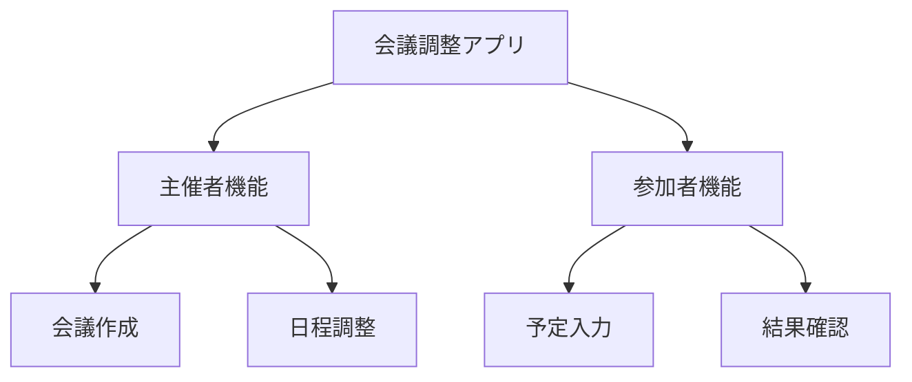
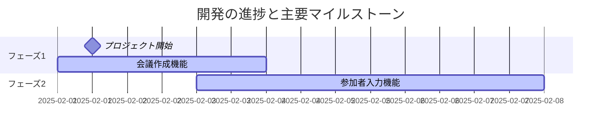
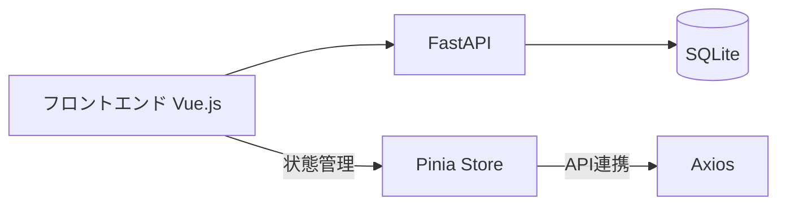
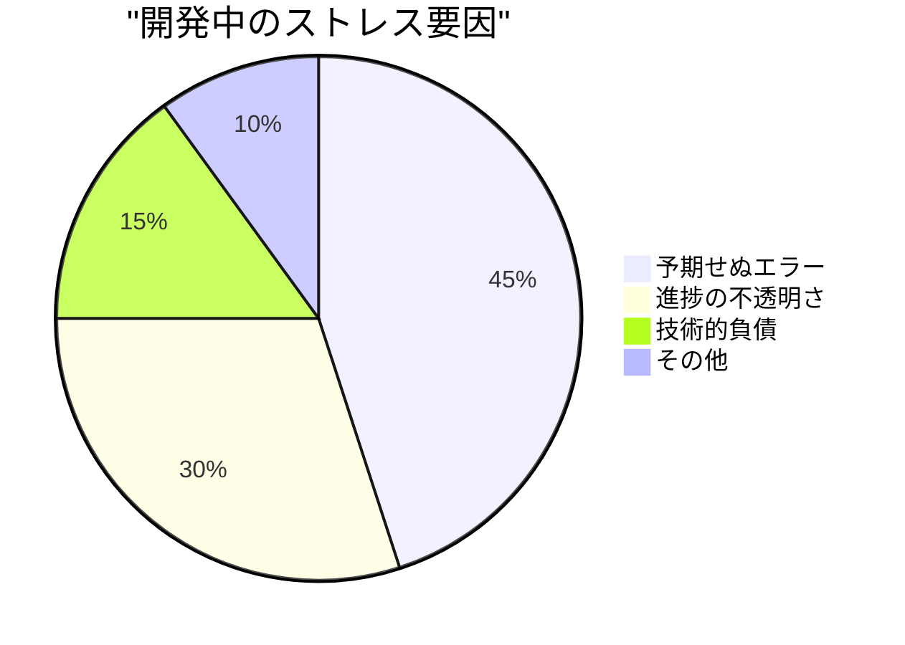
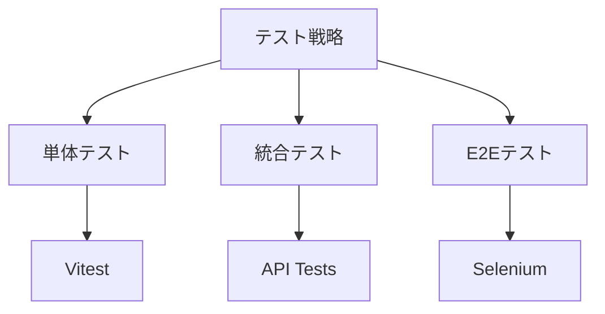
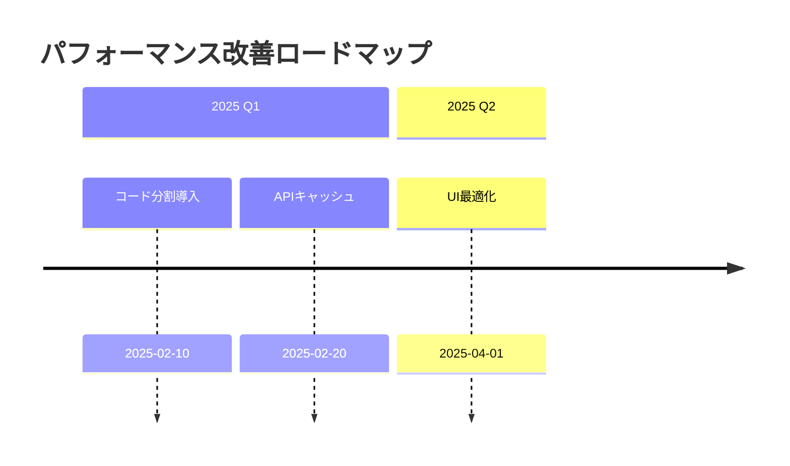
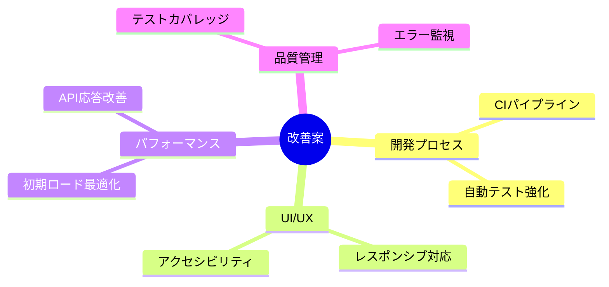

# 会議調整アプリケーション プロジェクト総合レビュー

## 1. プロジェクト概要と開発の軌跡

### 1.1 アプリケーションの目的と構成


### 1.2 開発タイムライン


## 2. 技術スタックと構成

### 2.1 アーキテクチャ


### 2.2 主要コンポーネント
```yaml
frontend:
  framework: Vue 3
  state_management: Pinia
  routing: Vue Router
  ui_components:
    - VCalendar
    - カスタムドラッグ&ドロップUI
  testing:
    - Vitest
    - Testing Library
    - Selenium

backend:
  framework: FastAPI
  database: SQLite
  orm: SQLAlchemy
  validation: Pydantic
```

## 3. 開発プロセスでの学び

### 3.1 主要な技術的課題と解決策
| 課題 | 原因 | 解決策 | 学び |
|------|------|--------|------|
| 画面遷移しない | router.jsの設定不備 | Vue Routerの正しい実装 | ルーティング設定の重要性 |
| 状態管理の混乱 | コンポーネント間の直接通信 | Piniaストアの導入 | 中央集権的な状態管理の必要性 |
| APIエラー処理 | 例外処理の不足 | try-catch導入とエラーUI | エラーハンドリングの標準化 |

### 3.2 感情的ストレス要因分析


### 3.3 認知バイアスとの戦い
1. **正常性バイアス**
   - 事例：APIエラーを「たまたま」と判断
   - 対策：エラーログの定量的分析導入
   - 結果：早期のバグ発見率向上

2. **確証バイアス**
   - 事例：成功パターンのみのテスト
   - 対策：エッジケーステストの義務化
   - 結果：品質の向上

## 4. 運用プロトコル

### 4.1 サーバー管理
```bash
# フロントエンド（3000番ポート）
lsof -i :3000 | awk 'NR!=1 {print $2}' | xargs kill -9

# バックエンド（3002番ポート）
lsof -i :3002 | awk 'NR!=1 {print $2}' | xargs kill -9
```

### 4.2 エラー表示規約
```
===================================
❌ エラーが発生しました
📍 エラー内容: [具体的なメッセージ]
🔧 対処方法: [具体的な手順]
===================================
```

## 5. 品質管理とテスト

### 5.1 自動テスト戦略


### 5.2 Seleniumテスト要件
```yaml
setup:
  - create_virtual_environment
  - install_selenium_dependencies
  - configure_chromedriver

workflow:
  - verify_server_status
  - run_selenium_tests
  - capture_screenshots
  - validate_layout

quality_checks:
  - element_positioning
  - responsive_design
  - interactive_elements
  - accessibility
```

## 6. セキュリティ対策

### 6.1 環境変数管理
```yaml
development:
  env_file: .env.local
  variables:
    - API_URL
    - DEBUG_MODE
    - DB_CONNECTION

production:
  env_management: "SecretsManager"
  rotation: "自動"
  access_control: "Role-based"
```

### 6.2 GitHub管理
- アカウント: sumichichi2015
- トークン管理: 月次ローテーション
- アクセス制御: リポジトリ単位

## 7. パフォーマンス最適化

### 7.1 測定指標
| 機能 | 目標値 | 現状 | 改善案 |
|------|--------|------|--------|
| 初期ロード | 2秒以内 | 3.5秒 | コード分割導入 |
| API応答 | 500ms以内 | 780ms | クエリ最適化 |
| UI操作 | 100ms以内 | 150ms | 仮想スクロール |

### 7.2 改善計画


## 8. 今後の課題

### 8.1 技術的負債
1. APIエラーハンドリングの統一
2. モバイルUIの最適化
3. テストカバレッジの向上
4. パフォーマンスチューニング

### 8.2 改善提案


## 9. 振り返りと教訓

### 9.1 成功要因
1. 早期のPinia導入による状態管理の統一
2. エラーハンドリングの標準化
3. 自動テストの導入

### 9.2 改善点
1. 初期設計の不足
2. テスト戦略の後回し
3. エラー処理の見落とし

### 9.3 次回プロジェクトへの提言
1. 設計フェーズの充実
2. テストファーストの徹底
3. エラーケースの網羅的検討
4. ドキュメント駆動開発の採用

## 10. 付録

### 10.1 関連ドキュメント
- [技術設計書](.windsurfrules)
- [API仕様書](backend/api_spec.md)
- [テスト計画書](config/checklists/test_scenarios.yml)

### 10.2 開発環境詳細
```json
{
  "node_version": "18.15.0",
  "python_version": "3.11.2",
  "dependencies": {
    "vue": "^3.3.0",
    "pinia": "^2.1.0",
    "fastapi": "0.95.0"
  }
}
```

このドキュメントは、プロジェクトの全体像を把握し、今後の改善に活かすための重要な資料となります。特に以下の点に注目してレビューをお願いします：

1. 技術選定の妥当性
2. 開発プロセスの効率性
3. エラーハンドリングの完全性
4. パフォーマンス最適化の可能性
5. セキュリティ対策の十分性
